# SIR-2.0
Documentació per integrar-se al servei SIR – Sistema de Interconexión de Registros


**Índex**
- [1. Introducció](#1)
- [2. Transmissions de dades disponibles](#2)
- [3. Missatgeria del servei](#3)
   * [3.1 3.1 Enviament d&#39;un intercanvi](#3.1)
        * [3.1.1 Petició – dades específiques](#3.1.1)
			* [3.1.1.1 Enviament (SICRES3)](#3.1.1.1)
		* [3.1.2 Petició – dades genèriques](#3.1.2)
		* [3.1.3 Resposta – dades específiques](#3.1.3)		
   * [3.2 Confirmació d&#39;un intercanvi rebut](#3.2)
        * [3.2.1 Petició – dades específiques](#3.2.1)
		* [3.2.2 Resposta – dades específiques](#3.2.2)
   * [3.3 Rebuig d&#39;un intercanvi rebut](#3.3)
		* [3.3.1 Petició – dades específiques](#3.3.1)
		* [3.3.2 Resposta – dades específiques](#3.3.2)
   * [3.4 Reenviament d&#39;un intercanvi rebut](#3.4)
		* [3.4.1 Petició – dades específiques](#3.4.1)
		* [3.4.2 Resposta – dades específiques](#3.4.2)
   * [3.5 Consulta de dades d&#39;un intercanvi](#3.5)
		* [3.5.1 Petició – dades específiques](#3.5.1)
		* [3.5.2 Resposta – dades específiques](#3.5.2)
   * [3.6 Sincronització d&#39;intercanvis](#3.6)
		* [3.6.1 Petició – dades específiques](#3.6.1)
		* [3.6.2 Resposta – dades específiques](#3.6.2)


# 1 Introducció <a name="1"></a>

Aquest document detalla la missatgeria associada al servei de publicació del _Sistema de Interconexión de Registros_ del MINHAP (en endavant SIR).

Per poder realitzar la integració cal conèixer prèviament la següent documentació:

- Document d&#39;_Especificació de missatgeria pel consum de productes de la plataforma PCI_ del Consorci AOC.
- _Manual de Integración con la Plataforma SIR (COD. SIR10021)_ per conèixer el protocol d&#39;intercanvi d&#39;assentaments.
- BOE: _Resolución de 19 de julio de 2011, de la Secretaría de Estado para la Función Pública, por la que se aprueba la Norma Técnica de Interoperabilidad de Modelo de Datos para el Intercambio de asientos entre las entidades registrales_ que defineix la norma tècnica SICRES (Sistema de Información Común de Registros de Entrada y Salida).

# 2 Transmissions de dades disponibles <a name="2"></a>

Les operacions disponibles a través del servei són les que es presenten a continuació:

| **EMISSOR** |
| --- |
| SIR (Sistema de Interconexión de Registros) |

| **PRODUCTE** | **MODALITAT** | **DESCRIPCIO** |
| --- | --- | --- |
| **SIR** | SIR | Operacions del servei de d&#39;intercanvi de registres del SIR: <li> Enviament d&#39;un assentament<li> Confirmació d&#39;un assentament<li> Rebuig d&#39;un assentament<li> Reenviament d&#39;un assentament<li> Consulta de dades d&#39;un assentament<li>Sincronització d&#39;assentaments|


---

 El servei requereix que s&#39;informin les dades del funcionari que realitza les operacions d&#39;enviament, confirmació, rebuig i reenviament. Així, cal informar els següents camps de l&#39;element Funcionario del bloc de dades genèriques:
```
/Peticion/Funcionario/NombreCompletoFuncionario
/Peticion/Funcionario/NifFuncionario
//SolicitudTransmision/DatosGenericos/Solicitante/Funcionario/NombreCompletoFuncionario
//SolicitudTransmision/DatosGenericos/Solicitante/
```
---

# 3 Missatgeria del servei <a name="3"></a>

A continuació es detalla la missatgeria corresponent al bloc de dades específiques de les diferents operacions del servei.

## 3.1 Enviament d&#39;un intercanvi <a name="3.1"></a>

### 3.1.1 Petició – dades específiques <a name="3.1.1"></a>

| _Element_ | _Descripció_ |
| --- | --- |
| /peticioEnviamentAssentament/idEnviament | Identificador de l&#39;enviament en el sistema origen. |
| /peticioEnviamentAssentament/enviament | XML corresponent al missatge SICRES3 de l&#39;assentament codificat com a CDATA.<br><br> Per més detalls sobre l&#39;estructura del XML [consulteu l&#39;apartat 3.1.1.1 d&#39;aquest document.](https://github.com/ConsorciAOC/SIR-2.0#3111-enviament-sicres3) |

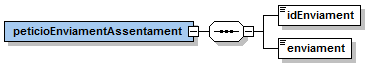

#### 3.1.1.1 Enviament (SICRES3) <a name="3.1.1.1"></a>

| _Element_ | _Descripció_ |
| --- | --- |
| /Fichero\_Intercambio\_SICRES\_3 | Bloc de dades corresponent al missatge SICRES3 amb les dades de l&#39;assentament a intercanviar.|
| /Fichero\_Intercambio\_SICRES\_3/De\_Origen\_o\_Remitente | Bloc de dades corresponent a les dades de l&#39;organisme que realitza l&#39;intercanvi (codificació DIR3). |
| //De\_Origen\_o\_Remitente/Codigo\_Entidad\_Registral\_Origen | Codi d&#39;oficina de registre origen. |
| //De\_Origen\_o\_Remitente/Decodificacion\_Entidad\_Registral\_Origen | Nom / descripció de l&#39;oficina de registre origen. |
| //De\_Origen\_o\_Remitente/Numero\_Registro\_Entrada |<li>Interadministratiu: no s&#39;ha d&#39;informar i el sistema ja genera el corresponent assentament.<li>Presencial: el número d&#39;assentament ja generat. |
| //De\_Origen\_o\_Remitente/Fecha\_Hora\_Entrada | Idem a l&#39;anterior. |
| //De\_Origen\_o\_Remitente/Codigo\_Unidad\_Tramitacion\_Origen | Codi d&#39;unitat organitzativa origen. |
| //De\_Origen\_o\_Remitente/Decodificacion\_Unidad\_Tramitacion\_Origen | Nom / descripció de la unitat organitzativa origen. |
| /Fichero\_Intercambio\_SICRES\_3/De\_Destino | Bloc de dades corresponent a les dades de l&#39;organisme destinatari de l&#39;intercanvi (codificació DIR3). |
| //De\_Destino/Codigo\_Entidad\_Registral\_Destino | Codi d&#39;oficina de registre destí. |
| //De\_Destino/Decodificacion\_Entidad\_Registral\_Destino | Nom / descripció de l&#39;oficina de registre destí. |
| //De\_Destino/Codigo\_Unidad\_Tramitacion\_ Destino | Codi d&#39;unitat organitzativa destí. |
| //De\_Destino /Decodificacion\_Unidad\_Tramitacion\_Destino | Nom / descripció de la unitat organitzativa destí. |
| /Fichero\_Intercambio\_SICRES\_3/De\_Interesado | Bloc de dades corresponents als interessats i representants. Per més detalls consulteu la especificació SICRES3. |
| /Fichero\_Intercambio\_SICRES\_3/De\_Asunto | Bloc de dades corresponents al l&#39;assumpte. Per més detalls consulteu la especificació SICRES3. |
| //De\_Asunto/Resumen | Títol / assumpte de l&#39;intercanvi. |
| /Fichero\_Intercambio\_SICRES\_3/De\_Anexo | Blocs de dades corresponents als annexos que acompanyen l&#39;intercanvi. |
| //De\_Anexo/Nombre\_Fichero\_Anexado | Nom del fitxer adjunt. |
| //De\_Anexo/Identificador\_Fichero | Identificador del fitxer adjunt. Únic en la petició.<br> Per identificar cada adjunt, caldrà alinear l&#39;atribut Fichero@Id del bloc de dades genèriques amb l&#39;element identificador de cadascun dels document informats en el missatge SICRES3.
 <br>El sistema SIR permet fins a un màxim de 5 adjunts, 10 MB per adjunt, 15 MB en total i les següents extensions permeses: .JPG, .JPEG, .ODT, .ODP, .ODS, .ODG, .DOCX, .XLSX, .PPTX, .PDF, .PNG, .RTF, .SVG, .TIFF, .TXT, .XSIG i .XML. |
| //De\_Anexo/Validez\_Documento |<li> 01: còpia<li> 02: còpia compulsada<li> 03: copia original<li> 04: original |
| //De\_Anexo/Tipo\_Documento |<li> 01: formulari<li> 02: adjunt<li> 03: document tècnic |
| /Fichero\_Intercambio\_SICRES\_3/De\_Internos\_Control | Bloc de dades de control. |
| //De\_Internos\_Control/Identificador\_Intercambio | No informar-lo. El generarà el propi servei al realitzar l&#39;enviament amb el format definit a les especificacions SICRES3. |
| //De\_Internos\_Control/Tipo\_Anotacion | 02: enviament. |
| //De\_Internos\_Control/Tipo\_Registro | 0: entrada. |
| //De\_Internos\_Control/Documentacion\_Fisica |<li> 1: Documentació física requerida.<li>2: Documentació física complementaria.<li>3: No acompanya documentació física. |
| //De\_Internos\_Control/Indicador\_Prueba | 0 |
| //De\_Internos\_Control /Codigo\_Entidad\_Registral\_Inicio | Codi d&#39;oficina i nom / descripció de registre inici. En un enviament el mateix que<br> *//De\_Origen\_o\_Remitente*<br> */Codigo\_Entidad\_Registral\_Origen* I <br>*//De\_Origen\_o\_Remitente<br>/Decodificacion\_Entidad\_Registral\_Origen respectivament.* |
| //De\_Internos\_Control /Decodificacion\_Entidad\_Registral\_Inicio |
| //De\_Formulario\_Generico/Expone | Exposició dels fets i antecedents relacionats amb la sol·licitud. |
| //De\_Formulario\_Generico/Solicita | Descripció de l&#39;objecte de la sol·licitud. |

### 3.1.2 Petició – dades genèriques <a name="3.1.2"></a>

#### Per cada document referenciat a la sol·licitud d&#39;enviament d&#39;assentament cal informar un bloc de dades *//Ficheros/Fichero* de les dades genèriques de la sol·licitud.

| _Element_ | _Descripció_ |
| --- | --- |
| //Ficheros/Fichero/NombreFichero | Nom de l&#39;adjunt. |
| //Ficheros/Fichero/Contenido | Contingut del fitxer en cas de transferència per MTOM (en la crida correspon a la referència XOP del fitxer). |
| //Ficheros/Fichero/RutaFichero | Alternativa a Contenido, permet informa la ruta (ha de ser accessible per la plataforma PCI del CAOC) on es troba el fitxer.|
| //Ficheros/Fichero/Id | Identificador de fitxer únic en la petició i eferenciat al missatge SICRES3. |

---
  El sistema SIR permet fins a un màxim de 5 adjunts, 10 MB per adjunt, 15 MB en total i les següents extensions permeses: .JPG, .JPEG, .ODT, .ODP, .ODS, .ODG, .DOCX, .XLSX, .PPTX, .PDF, .PNG, .RTF, .SVG, .TIFF, .TXT, .XSIG i .XML. 

 ---

### 3.1.3 Resposta – dades específiques <a name="3.1.3"></a>

| _Element_ | _Descripció_ |
| --- | --- |
| /respostaEnviamentAssentament/resposta/idEnviamentSIR | Identificador SIR que identifica l&#39;intercanvi. |
| /respostaEnviamentAssentament/resposta/origenRegistreEntrada | Si l&#39;intercanvi és interadministratiu, dades de l&#39;assentament generat contra MUX que s&#39;intercanviarà. Si és presencial, les dades de l&#39;assentament informades a la petició SICRES3. |
| /respostaEnviamentAssentament/resposta/origenRegistreEntradaData | Data de l&#39;assentament a intercanviar (ídem a l&#39;anterior). |
| /respostaEnviamentAssentament/resultat/codiResultat | Codi de resultat de l&#39;operació:<li> 0: intercanvi enviat correctament.<li>502: error en el tractament del enviament. |
| /respostaEnviamentAssentament/resultat/descripcio | Descripció del resultat. |

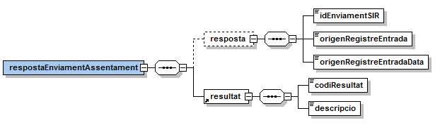

## 3.2 Confirmació d&#39;un intercanvi rebut <a name="3.2"></a>
 
### 3.2.1 Petició – dades específiques <a name="3.2.1"></a>

| _Element_ | _Descripció_ |
| --- | --- |
| /peticioConfirmacioAssentament/idEnviamentSIR | Identificador SIR de l&#39;intercanvi a confirmar. |


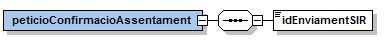

### 3.2.2 Resposta – dades específiques <a name="3.2.2"></a>

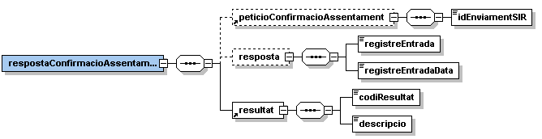

| _Element_ | _Descripció_ |
| --- | --- |
| /respostaConfirmacioAssentament/peticioConfirmacioAssentament | Dades de la petició que origina la resposta. |
| //resposta/registreEntrada | Número d&#39;assentament d&#39;entrada. |
| //resposta/registreEntradaData | Data de l&#39;assentament d&#39;entrada. |
 | /respostaConfirmacioAssentament/resultat/codiResultat | Codi de resultat de la operació:<li>0: confirmació realitzada correctament.<li> 502: error realitzant la confirmació.|
| /respostaConfirmacioAssentament /resultat/descripcio | Descripció del resultat de la operació. |

## 3.3 Rebuig d&#39;un intercanvi rebut <a name="3.3"></a>

### 3.3.1 Petició – dades específiques <a name="3.3.1"></a>

| _Element_ | _Descripció_ |
| --- | --- |
| /peticioRebuigAssentament/idEnviamentSIR | Identificador SIR de l&#39;intercanvi a rebutjar. |
| /peticioRebuigAssentament/motiu | Motiu de rebuig (cal informar-lo en castellà ja que el destinatari pot ser un organisme de la resta de l&#39;Estat). |


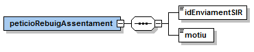

### 3.3.2 Resposta – dades específiques <a name="3.3.2"></a>

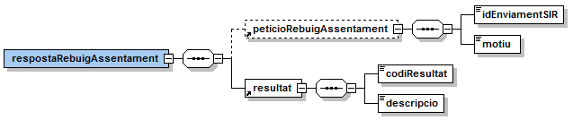

| _Element_ | _Descripció_ |
| --- | --- |
| /respostaRebuigAssentament/peticioRebuigAssentament  | Dades de la petició que origina la resposta. |
| /respostaRebuigAssentament/resultat/codiResultat | Codi de resultat de la operació:<li> 0: rebuig realitzat correctament.<li> 502: error realitzant el rebuig. |
| /respostaRebuigAssentament /resultat/descripcio | Descripció del resultat de la operació. |

## 3.4 Reenviament d&#39;un intercanvi rebut <a name="3.4"></a>

### 3.4.1 Petició – dades específiques <a name="3.4.1"></a>

| _Element_ | _Descripció_ |
| --- | --- |
| /peticioReenviamentAssentament/idEnviamentSIR | Identificador SIR de l&#39;intercanvi a reenviar. |
| /peticioReenviamentAssentament/oficinaRegistreDesti | Oficina destinatària del reenviament (codificació DIR3). |
| /peticioReenviamentAssentament/observacions | Observacions / motiu de reenviament (cal informar-lo en castellà ja que el destinatari pot ser un organisme de la resta de l&#39;Estat). |

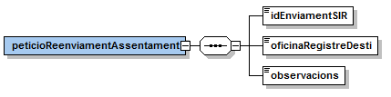

### 3.4.2 Resposta – dades específiques <a name="3.4.2"></a>
 
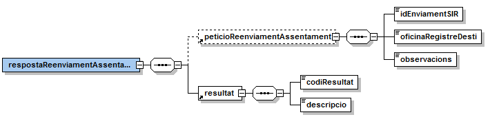

| _Element_ | _Descripció_ |
| --- | --- |
| /respostaReenviamentAssentament/peticioReenviamentAssentament
 | Dades de la petició que origina la resposta. |
| /respostaReenviamentAssentament/resultat/codiResultat | Codi de resultat de la operació:<li> 0: reenviament realitzat correctament.<li> 502: error realitzant el reenviament. |
| /respostaReenviamentAssentament /resultat/descripcio | Descripció del resultat de la operació. |

## 3.5 Consulta de dades d&#39;un intercanvi <a name="3.5"></a>

### 3.5.1 Petició – dades específiques <a name="3.5.1"></a>

| _Element_ | _Descripció_ |
| --- | --- |
| /peticioConsultaAssentament/idEnviamentSIR | Identificador SIR de l&#39;intercanvi a consultar (tant enviats com rebuts). |
| /peticioConsultaAssentament/tipus | Tipus d&#39;intercanvi (ENVIAT / REBUT). |

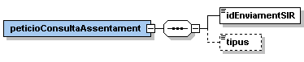

### 3.5.2 Resposta – dades específiques <a name="3.5.2"></a>

| _Element_ | _Descripció_ |
| --- | --- |
| /respostaConsulaAssentament/peticioConsultaAssentament
 | Dades de la petició que origina la resposta. |
| //intercanvi | Bloc de dades corresponent a les dades de l&#39;intercanvi. |
| //intercanvi/idEnviament | Identificador de l&#39;enviament en el sistema origen. |
| //intercanvi/idIntercanviSIR | Identificador SIR de l&#39;intercanvi. |
| //intercanvi/oficinaInicial | Oficina de registre inicial (codificació DIR3). |
| //intercanvi/oficinaOrigen | Oficina de registre origen (codificació DIR3). |
| //intercanvi/oficinaDesti | Oficina de registre destí (codificació DIR3). |
| //intercanvi/origenRegistreEntrada | Número d&#39;assentament d&#39;entrada en origen. |
 | //intercanvi/origenRegistreEntradaData | Data de l&#39;assentament d&#39;entrada en origen. |
| //intercanvi/destiRegistreEntrada | Número d&#39;assentament d&#39;entrada en destí. |
| //intercanvi/destiRegistreEntradaData | Data de l&#39;assentament d&#39;entrada en destí. |
| //intercanvi/registreSortida | Número d&#39;assentament realitzat per EACAT en l&#39;enviament. |
| //intercanvi/estat | Estat de l&#39;intercanvi:<li> ENVIAT<li>PENDENT\_CONFIRMACIO<li> CONFIRMAT<li> REBUTJAT<li> REENVIAT<li> ERROR |
| //intercanvi/enviament | XML SICRES3 de l&#39;intercanvi. |
| //apunts/apunt | Bloc de dades corresponent a una actuació realitzada sobre l&#39;intercanvi. |
| //apunt/data | Data de l&#39;apunt / actuació. |
| //apunt/tipus | Tipus d&#39;apunt / actuació:<li> ENVIAMENT<li> CONFIRMACIO<li> REBUIG <li> REENVIAMENT<li> ERROR |
| //apunt/missatge | Missatge informatiu vinculat a l&#39;apunt / actuació. |
| //apunt/oficinaOrigen | Oficina origen que rep la actuació (codificació DIR3). |
| //apunt/oficinaDesti | Oficina origen que realitza la actuació (codificació DIR3). |
| //apunt/oficinaDenominacio | Denominació de l&#39;oficina que realitza l&#39;actuació. |
| //apunt/usuari | Usuari que ha realitzat l&#39;operació. |
| //annexos/annex | Bloc de dades corresponent als annexos associats a l&#39;intercanvi. |
| //annex/nomFitxer | Nom del fitxer. |
| //annex/idFitxerSIR | Identificador SIR del fitxer. |
| //annex/guid | GUID del fitxer que permet la descàrrega __¹__ del fitxer. |
| //annex/ruta | Ruta del fitxer en el repositori de documents del servei SIR (accessible només per EACAT). |
| /respostaConsultaAssentament/resultat/codiResultat | Codi de resultat de la operació:<li> 0: consulta realitzada correctament.<li>502: error realitzant la consulta. |
| /respostaConsultaAssentament /resultat/descripcio | Descripció del resultat de la operació. |

----

__¹__ URL de descàrrega a producció: https://serveis3.app.aoc.cat/CAOC-PCI30-MC-SIR/descarrega?guid=<GUID>

---

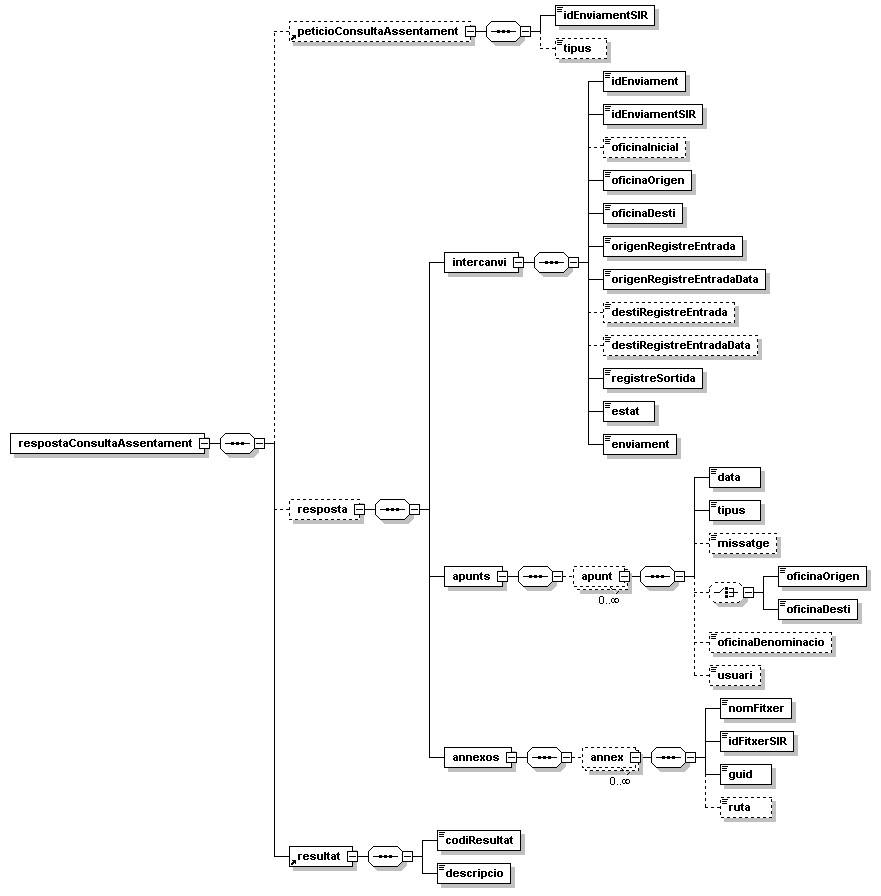

## 3.6 Sincronització d&#39;intercanvis <a name="3.6"></a>
 
### 3.6.1 Petició – dades específiques <a name="3.6.1"></a>

| _Element_ | _Descripció_ |
| --- | --- |
| /peticioSincronitzacioAssentaments | Bloc de petició de sincronització d&#39;intercanvis. No requereix cap element addicional. |


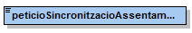

### 3.6.2 Resposta – dades específiques <a name="3.6.2"></a>

| _Element_ | _Descripció_ |
| --- | --- |
| /respostaSincronitzacioAssentaments/resposta/intercanvi
 | Dades de la petició que origina la resposta. |
| //intercanvi/idEnviament | Identificador de l&#39;enviament en el sistema origen. |
| //intercanvi/idIntercanviSIR | Identificador SIR de l&#39;intercanvi. |
| //intercanvi/oficinaInicial | Oficina de registre inicial (codificació DIR3). |
| //intercanvi/oficinaOrigen | Oficina de registre origen (codificació DIR3). |
| //intercanvi/oficinaDesti | Oficina de registre destí (codificació DIR3). |
| //intercanvi/origenRegistreEntrada | Número d&#39;assentament d&#39;entrada en origen. |
| //intercanvi/origenRegistreEntradaData | Data de l&#39;assentament d&#39;entrada en origen. |
| //intercanvi/destiRegistreEntrada | Número d&#39;assentament d&#39;entrada en destí. |
| //intercanvi/destiRegistreEntradaData | Data de l&#39;assentament d&#39;entrada en destí. |
| //intercanvi/tipus | Tipus d&#39;apunt / actuació:<li> PENDENT\_CONFIRMACIO<li> CONFIRMACIO<li> REBUTJAT<li> ERROR<li> REBUT |
| //intercanvi/data | Data de l&#39;operació. |
| /respostaSincronitzacioAssentaments/resultat/codiResultat | Codi de resultat de la operació:<li> 0: sincronització realitzada correctament.<li> 502: error realitzant la sincronització. |
| /respostaSincronitzacioAssentaments /resultat/descripcio | Descripció del resultat de la operació. |

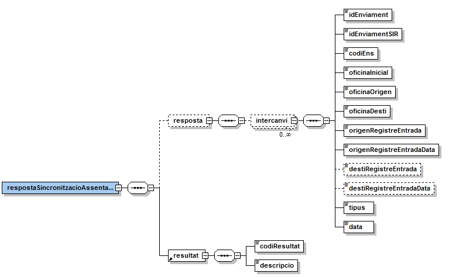